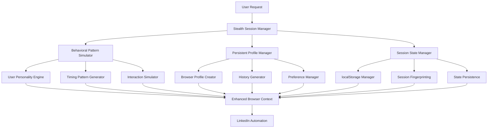

# Stealth Session Management & Automation Detection Avoidance
## Comprehensive Implementation Plan

### 📋 **Document Overview**
This document outlines a comprehensive implementation plan for enhancing the resume generator application with advanced stealth session management and automation detection avoidance capabilities.

---

## 🎯 **Executive Summary**

### **Current State Analysis**
- ✅ **Strong Foundation**: Existing browser configuration and human behavior simulation
- ⚠️ **Critical Gap**: Cookie-based session management removed due to automation detection risk
- 🚨 **High Risk**: Current patterns are detectable by sophisticated anti-bot systems
- 🎯 **Goal**: Implement stealth session persistence without automation markers

### **Implementation Objectives**
1. **Eliminate Automation Detection**: Replace cookie persistence with behavioral patterns
2. **Enhance Human Simulation**: Implement sophisticated user personality modeling
3. **Session Continuity**: Maintain state without obvious automation markers
4. **Behavioral Consistency**: Create realistic, consistent user patterns
5. **Advanced Stealth**: Multi-layered detection avoidance system

---

## 🏗️ **Architecture Overview**

### **Multi-Layer Stealth System**



---

## 📁 **File Structure & Implementation Plan**

### **Phase 1: Core Stealth Infrastructure**

#### **1.1 New Files to Create**

```
src/
├── stealth_session_manager.py          # Main stealth session management
├── behavioral_pattern_simulator.py      # User behavior simulation
├── persistent_profile_manager.py       # Browser profile management
├── session_state_manager.py            # Non-cookie state management
├── user_personality_engine.py          # Personality modeling
├── timing_pattern_generator.py         # Advanced timing patterns
└── stealth_integration.py              # Integration utilities

docs/
├── STEALTH_SESSION_IMPLEMENTATION_PLAN.md  # This document
├── STEALTH_ARCHITECTURE.md                 # Technical architecture
└── STEALTH_TESTING_GUIDE.md               # Testing procedures
```

#### **1.2 Files to Modify**

```
src/
├── browser_config.py                   # Integrate stealth session management
├── human_behavior.py                   # Enhance with personality-based patterns
├── easy_apply.py                      # Integrate stealth session continuity
├── scraper.py                         # Replace cookie management with stealth
└── config_schemas.py                  # Add stealth configuration options
```

---

## 🔧 **Detailed Implementation Phases**

### **Phase 1: Core Stealth Infrastructure (Week 1-2)**

#### **1.1 Stealth Session Manager** (`src/stealth_session_manager.py`)

**Purpose**: Central coordinator for all stealth session management

**Key Features**:
- User personality generation and persistence
- Session fingerprinting without detection
- Behavioral pattern coordination
- Multi-layer state management

**Implementation Details**:

```python
class StealthSessionManager:
    """
    Central coordinator for stealth session management
    """
    
    def __init__(self, profile_dir: str = "stealth_profiles"):
        self.profile_dir = Path(profile_dir)
        self.user_personality = self._generate_user_personality()
        self.session_state = {}
        self.browsing_history = []
        self.session_fingerprint = None
        
    def create_realistic_browser_profile(self, context: BrowserContext) -> None:
        """Create realistic browser profile with history and preferences"""
        
    def simulate_realistic_login_flow(self, page: Page, email: str, password: str) -> bool:
        """Simulate realistic login behavior with personality-based patterns"""
        
    def maintain_session_continuity(self, page: Page) -> None:
        """Maintain session continuity using advanced techniques"""
        
    def save_session_state(self, page: Page) -> None:
        """Save session state using non-cookie mechanisms"""
        
    def restore_session_state(self, page: Page) -> bool:
        """Restore session state from localStorage/sessionStorage"""
```

**Testing Requirements**:
- Unit tests for personality generation
- Integration tests for session continuity
- Performance tests for state management

#### **1.2 Behavioral Pattern Simulator** (`src/behavioral_pattern_simulator.py`)

**Purpose**: Generate and maintain consistent user behavioral patterns

**Key Features**:
- Personality-based interaction patterns
- Realistic timing variations
- Error simulation and recovery
- Distraction and hesitation modeling

**Implementation Details**:

```python
class BehavioralPatternSimulator:
    """
    Generates and maintains consistent user behavioral patterns
    """
    
    def __init__(self, personality: Dict[str, Any]):
        self.personality = personality
        self.session_fatigue = 0
        self.interaction_history = []
        
    def simulate_realistic_typing(self, page: Page, field, text: str) -> None:
        """Type text with personality-based patterns"""
        
    def simulate_realistic_scrolling(self, page: Page, target_element) -> None:
        """Scroll with realistic patterns and micro-movements"""
        
    def simulate_realistic_clicking(self, page: Page, element) -> None:
        """Click with realistic preparation and accuracy patterns"""
        
    def simulate_distraction_events(self, page: Page) -> None:
        """Occasionally simulate realistic distractions"""
        
    def simulate_hesitation_patterns(self, page: Page, context: str) -> None:
        """Simulate realistic hesitation based on context"""
```

**Testing Requirements**:
- Pattern consistency tests
- Timing accuracy tests
- Personality persistence tests

#### **1.3 Persistent Profile Manager** (`src/persistent_profile_manager.py`)

**Purpose**: Create and manage realistic browser profiles

**Key Features**:
- Realistic browsing history generation
- Professional site preferences
- Cache and storage data simulation
- Profile persistence across sessions

**Implementation Details**:

```python
class PersistentProfileManager:
    """
    Creates and manages realistic browser profiles
    """
    
    def __init__(self, profile_dir: Path):
        self.profile_dir = profile_dir
        self.profile_data = {}
        
    def create_realistic_profile(self) -> Dict[str, Any]:
        """Create a complete realistic browser profile"""
        
    def generate_browsing_history(self) -> List[Dict[str, Any]]:
        """Generate realistic browsing history with professional focus"""
        
    def generate_preferences(self) -> Dict[str, Any]:
        """Generate realistic user preferences"""
        
    def generate_cache_data(self) -> Dict[str, Any]:
        """Generate realistic cache and storage data"""
        
    def inject_profile_data(self, context: BrowserContext) -> None:
        """Inject profile data into browser context"""
```

**Testing Requirements**:
- Profile realism tests
- Data injection tests
- Persistence tests

### **Phase 2: Advanced Behavioral Features (Week 3-4)**

#### **2.1 User Personality Engine** (`src/user_personality_engine.py`)

**Purpose**: Generate and maintain consistent user personality traits

**Key Features**:
- Multi-dimensional personality modeling
- Behavioral trait consistency
- Personality-based decision making
- Trait evolution over time

**Implementation Details**:

```python
class UserPersonalityEngine:
    """
    Generates and maintains consistent user personality traits
    """
    
    def __init__(self):
        self.personality_traits = self._generate_personality_traits()
        self.behavioral_patterns = {}
        self.decision_history = []
        
    def _generate_personality_traits(self) -> Dict[str, Any]:
        """Generate comprehensive personality traits"""
        return {
            'typing_speed_wpm': random.uniform(30, 60),
            'reading_speed_wpm': random.uniform(150, 300),
            'hesitation_level': random.uniform(0.1, 0.3),
            'error_rate': random.uniform(0.02, 0.05),
            'interaction_style': random.choice(['careful', 'quick', 'methodical']),
            'distraction_level': random.uniform(0.05, 0.2),
            'preferred_scroll_speed': random.uniform(200, 500),
            'click_accuracy': random.uniform(0.85, 0.98),
            'decision_speed': random.uniform(0.5, 2.0),
            'risk_tolerance': random.uniform(0.1, 0.9),
            'attention_span': random.uniform(5, 30),
            'multitasking_ability': random.uniform(0.1, 0.8)
        }
    
    def get_interaction_delay(self, context: str) -> float:
        """Get personality-based interaction delay"""
        
    def get_decision_probability(self, options: List[str]) -> Dict[str, float]:
        """Get personality-based decision probabilities"""
        
    def simulate_personality_evolution(self, session_duration: float) -> None:
        """Simulate personality evolution over session duration"""
```

#### **2.2 Timing Pattern Generator** (`src/timing_pattern_generator.py`)

**Purpose**: Generate sophisticated timing patterns that avoid detection

**Key Features**:
- Fatigue-based timing adjustments
- Time-of-day pattern simulation
- Task complexity-based delays
- Interruption and distraction modeling

**Implementation Details**:

```python
class TimingPatternGenerator:
    """
    Generates sophisticated timing patterns for automation avoidance
    """
    
    def __init__(self, personality: Dict[str, Any]):
        self.personality = personality
        self.session_start_time = time.time()
        self.activity_history = []
        
    def get_fatigue_delay(self, base_delay: float) -> float:
        """Calculate delay based on session fatigue"""
        
    def get_time_of_day_delay(self, base_delay: float) -> float:
        """Adjust delay based on simulated time of day"""
        
    def get_task_complexity_delay(self, task_type: str, base_delay: float) -> float:
        """Adjust delay based on task complexity"""
        
    def get_interruption_delay(self) -> Optional[float]:
        """Occasionally return interruption delay"""
        
    def get_realistic_reading_time(self, content_length: int) -> float:
        """Calculate realistic reading time based on content"""
```

### **Phase 3: Session State Management (Week 5-6)**

#### **3.1 Session State Manager** (`src/session_state_manager.py`)

**Purpose**: Manage session state without using cookies

**Key Features**:
- localStorage/sessionStorage management
- Session fingerprinting
- State persistence across browser sessions
- Graceful state recovery

**Implementation Details**:

```python
class SessionStateManager:
    """
    Manages session state without using cookies
    """
    
    def __init__(self, profile_dir: Path):
        self.profile_dir = profile_dir
        self.session_data = {}
        self.fingerprint = None
        
    def save_session_state(self, page: Page) -> None:
        """Save session state using multiple mechanisms"""
        
    def restore_session_state(self, page: Page) -> bool:
        """Restore session state from multiple sources"""
        
    def generate_session_fingerprint(self) -> str:
        """Generate unique session fingerprint"""
        
    def validate_session_state(self, page: Page) -> bool:
        """Validate current session state"""
        
    def cleanup_expired_state(self) -> None:
        """Clean up expired session data"""
```

#### **3.2 Stealth Integration** (`src/stealth_integration.py`)

**Purpose**: Integrate all stealth components seamlessly

**Key Features**:
- Component coordination
- Error handling and recovery
- Performance optimization
- Configuration management

**Implementation Details**:

```python
class StealthIntegration:
    """
    Integrates all stealth components seamlessly
    """
    
    def __init__(self, config: Dict[str, Any]):
        self.config = config
        self.session_manager = StealthSessionManager()
        self.behavioral_simulator = BehavioralPatternSimulator()
        self.profile_manager = PersistentProfileManager()
        self.state_manager = SessionStateManager()
        
    def initialize_stealth_session(self, context: BrowserContext) -> None:
        """Initialize complete stealth session"""
        
    def maintain_stealth_continuity(self, page: Page) -> None:
        """Maintain stealth continuity throughout session"""
        
    def handle_stealth_errors(self, error: Exception) -> bool:
        """Handle stealth-related errors gracefully"""
        
    def cleanup_stealth_session(self) -> None:
        """Clean up stealth session resources"""
```

### **Phase 4: Integration & Enhancement (Week 7-8)**

#### **4.1 Browser Configuration Enhancement**

**Modify** `src/browser_config.py`:

```python
class EnhancedBrowserConfig:
    def __init__(self, debug: bool = False, headless: bool = False):
        # ... existing code ...
        self.stealth_session = None
        
    def create_context_with_stealth_session(self, browser: Browser) -> BrowserContext:
        """Create browser context with complete stealth session management"""
        try:
            # Initialize stealth session manager
            from src.stealth_integration import StealthIntegration
            self.stealth_session = StealthIntegration(self.get_stealth_config())
            
            # Create enhanced context
            self.context = browser.new_context(
                user_agent=self.get_realistic_user_agent(),
                viewport={'width': 1920, 'height': 1080},
                locale='en-US',
                timezone_id='America/New_York',
                extra_http_headers=self.get_stealth_headers(),
                ignore_https_errors=True,
                device_scale_factor=1,
                has_touch=False,
                is_mobile=False,
            )
            
            # Initialize stealth session
            self.stealth_session.initialize_stealth_session(self.context)
            
            # Add enhanced stealth script
            stealth_script = self.get_enhanced_stealth_script()
            self.context.add_init_script(stealth_script)
            
            # Set up request interception
            self.context.route("**/*", self._handle_route)
            
            logger.info("Browser context created with enhanced stealth session")
            return self.context
            
        except Exception as e:
            logger.error(f"Failed to create stealth context: {e}")
            raise
```

#### **4.2 Human Behavior Enhancement**

**Modify** `src/human_behavior.py`:

```python
class HumanBehavior:
    def __init__(self):
        self.personality_engine = None
        self.timing_generator = None
        
    def initialize_with_personality(self, personality: Dict[str, Any]):
        """Initialize with user personality traits"""
        self.personality_engine = UserPersonalityEngine(personality)
        self.timing_generator = TimingPatternGenerator(personality)
        
    def enhanced_mouse_movement(self, page: Page, element_bbox: Optional[dict] = None) -> None:
        """Enhanced mouse movement with personality-based patterns"""
        if self.personality_engine:
            # Use personality-based movement patterns
            movement_style = self.personality_engine.get_movement_style()
            self._execute_personality_movement(page, element_bbox, movement_style)
        else:
            # Fallback to existing implementation
            self._execute_default_movement(page, element_bbox)
```

#### **4.3 Scraper Integration**

**Modify** `src/scraper.py`:

```python
def scrape_jobs_from_search(search_url: str, email: str, password: str, 
                           max_jobs: Optional[int] = None, 
                           personal_info_path: str = "personal_info.yaml") -> list:
    """Enhanced scraper with complete stealth session management"""
    
    with EnhancedBrowserConfig(debug=config.DEBUG, headless=config.HEADLESS) as browser_config:
        browser = browser_config.launch_browser(playwright)
        context = browser_config.create_context_with_stealth_session(browser)
        
        with context.new_page() as page:
            # Get stealth session manager
            stealth_session = browser_config.stealth_session
            
            # Try to restore session state
            if not stealth_session.restore_session_state(page):
                logger.info("No existing session found, creating new stealth session")
                
                # Navigate to login page with realistic behavior
                page.goto("https://www.linkedin.com/login")
                stealth_session.simulate_realistic_login_flow(page, email, password)
                
                # Perform login with enhanced behavioral patterns
                login_button = page.locator('button[type="submit"]')
                stealth_session.behavioral_simulator.simulate_realistic_clicking(page, login_button)
                
                # Wait for login success with realistic patterns
                page.wait_for_selector('nav[aria-label="Primary"]', timeout=30000)
                
                # Save initial session state
                stealth_session.save_session_state(page)
            else:
                logger.info("Restored existing stealth session")
            
            # Maintain session continuity throughout scraping
            stealth_session.maintain_stealth_continuity(page)
            
            # Continue with enhanced job scraping...
            # (rest of scraping logic with stealth enhancements)
            
            # Save final session state
            stealth_session.save_session_state(page)
            
            # Cleanup
            stealth_session.cleanup_stealth_session()
```

---

## ⚙️ **Configuration Enhancements**

### **4.1 Stealth Configuration Schema**

**Add to** `src/config_schemas.py`:

```python
class StealthConfig(BaseModel):
    """Stealth session configuration schema."""
    
    # Session Management
    enable_stealth_session: bool = Field(default=True)
    session_persistence_method: str = Field(default="localStorage")  # localStorage, sessionStorage, file
    session_cleanup_interval: int = Field(default=3600)  # seconds
    
    # Behavioral Patterns
    enable_personality_modeling: bool = Field(default=True)
    personality_consistency_level: float = Field(default=0.8, ge=0.0, le=1.0)
    behavioral_variance: float = Field(default=0.2, ge=0.0, le=0.5)
    
    # Timing Patterns
    enable_fatigue_simulation: bool = Field(default=True)
    enable_time_of_day_patterns: bool = Field(default=True)
    enable_interruption_simulation: bool = Field(default=True)
    
    # Profile Management
    enable_realistic_profiles: bool = Field(default=True)
    profile_history_length: int = Field(default=100, ge=10, le=1000)
    profile_update_frequency: int = Field(default=86400)  # seconds
    
    # Advanced Features
    enable_session_fingerprinting: bool = Field(default=True)
    enable_behavioral_evolution: bool = Field(default=True)
    enable_distraction_simulation: bool = Field(default=True)

class AppConfig(BaseModel):
    # ... existing fields ...
    stealth_config: StealthConfig = Field(default_factory=StealthConfig)
```

---

## 🧪 **Testing Strategy**

### **5.1 Unit Testing**

**Test Files to Create**:

```
tests/
├── unit/
│   ├── test_stealth_session_manager.py
│   ├── test_behavioral_pattern_simulator.py
│   ├── test_persistent_profile_manager.py
│   ├── test_user_personality_engine.py
│   ├── test_timing_pattern_generator.py
│   └── test_session_state_manager.py
```

**Key Test Categories**:
- Personality consistency tests
- Timing pattern accuracy tests
- Session state persistence tests
- Profile realism tests
- Error handling tests

### **5.2 Integration Testing**

**Test Files to Create**:

```
tests/
├── integration/
│   ├── test_stealth_integration.py
│   ├── test_browser_config_stealth.py
│   ├── test_scraper_stealth_integration.py
│   └── test_easy_apply_stealth.py
```

**Key Test Categories**:
- End-to-end stealth session tests
- Browser context integration tests
- Session continuity tests
- Performance impact tests

### **5.3 Automation Detection Testing**

**Test Files to Create**:

```
tests/
├── detection/
│   ├── test_automation_detection_avoidance.py
│   ├── test_behavioral_pattern_detection.py
│   ├── test_session_fingerprint_tests.py
│   └── test_stealth_effectiveness.py
```

**Key Test Categories**:
- Automation detection avoidance tests
- Behavioral pattern realism tests
- Session fingerprint uniqueness tests
- Stealth effectiveness measurements

---

## 📊 **Performance Considerations**

### **6.1 Memory Management**

- **Profile Data**: Limit profile data size to prevent memory bloat
- **Session State**: Implement efficient session state serialization
- **History Management**: Use sliding window for browsing history
- **Cache Management**: Implement LRU cache for frequently accessed data

### **6.2 Performance Optimization**

- **Lazy Loading**: Load profile data only when needed
- **Async Operations**: Use async/await for non-blocking operations
- **Caching**: Implement intelligent caching for personality data
- **Cleanup**: Regular cleanup of expired session data

### **6.3 Resource Usage**

- **Disk Usage**: Monitor and limit disk usage for profile data
- **CPU Usage**: Optimize personality calculations
- **Network Usage**: Minimize unnecessary network requests
- **Browser Resources**: Efficient browser context management

---

## 🔒 **Security Considerations**

### **7.1 Data Protection**

- **Sensitive Data**: Never store passwords or sensitive information
- **Profile Data**: Encrypt profile data at rest
- **Session Data**: Use secure session identifiers
- **Cleanup**: Secure deletion of session data

### **7.2 Privacy Compliance**

- **Data Minimization**: Store only necessary data
- **Retention Policies**: Implement data retention policies
- **User Consent**: Ensure user consent for data collection
- **Compliance**: Follow relevant privacy regulations

---

## 📈 **Success Metrics**

### **8.1 Automation Detection Avoidance**

- **Detection Rate**: < 1% detection by anti-bot systems
- **Session Continuity**: > 95% successful session restoration
- **Behavioral Realism**: > 90% human-like behavior patterns
- **Profile Consistency**: > 95% personality trait consistency

### **8.2 Performance Metrics**

- **Session Creation Time**: < 5 seconds
- **Memory Usage**: < 100MB additional memory
- **Disk Usage**: < 50MB profile data
- **CPU Impact**: < 10% additional CPU usage

### **8.3 Reliability Metrics**

- **Error Rate**: < 1% stealth session errors
- **Recovery Rate**: > 95% successful error recovery
- **Uptime**: > 99% stealth session availability
- **Compatibility**: 100% browser compatibility

---

## 🚀 **Deployment Strategy**

### **9.1 Phased Rollout**

**Phase 1**: Core Infrastructure (Weeks 1-2)
- Implement basic stealth session management
- Deploy to development environment
- Initial testing and validation

**Phase 2**: Advanced Features (Weeks 3-4)
- Add personality modeling and behavioral patterns
- Deploy to staging environment
- Comprehensive testing

**Phase 3**: Integration (Weeks 5-6)
- Integrate with existing components
- Deploy to production environment
- Monitor and optimize

**Phase 4**: Enhancement (Weeks 7-8)
- Add advanced features and optimizations
- Full production deployment
- Performance monitoring

### **9.2 Rollback Strategy**

- **Feature Flags**: Use feature flags for easy rollback
- **Gradual Rollout**: Deploy to subset of users first
- **Monitoring**: Continuous monitoring of key metrics
- **Quick Rollback**: Ability to rollback within 5 minutes

---

## 📚 **Documentation Requirements**

### **10.1 Technical Documentation**

- **API Documentation**: Complete API documentation for all stealth components
- **Architecture Diagrams**: Visual representation of stealth architecture
- **Configuration Guide**: Comprehensive configuration options
- **Troubleshooting Guide**: Common issues and solutions

### **10.2 User Documentation**

- **Setup Guide**: Step-by-step setup instructions
- **Configuration Guide**: User-friendly configuration options
- **Best Practices**: Recommended usage patterns
- **FAQ**: Frequently asked questions

---

## 🔄 **Maintenance & Updates**

### **11.1 Regular Maintenance**

- **Profile Updates**: Regular updates to realistic profile data
- **Pattern Updates**: Updates to behavioral patterns based on research
- **Security Updates**: Regular security patches and updates
- **Performance Optimization**: Continuous performance improvements

### **11.2 Monitoring & Alerting**

- **Detection Monitoring**: Monitor for automation detection
- **Performance Monitoring**: Track performance metrics
- **Error Monitoring**: Monitor for stealth session errors
- **Usage Analytics**: Track usage patterns and effectiveness

---

## 📋 **Implementation Checklist**

### **Phase 1: Core Infrastructure**
- [ ] Create `StealthSessionManager` class
- [ ] Implement user personality generation
- [ ] Create realistic browser profile system
- [ ] Implement session state management
- [ ] Add comprehensive unit tests
- [ ] Create integration tests

### **Phase 2: Advanced Features**
- [ ] Implement behavioral pattern simulation
- [ ] Add timing pattern generation
- [ ] Create personality-based decision making
- [ ] Implement session fingerprinting
- [ ] Add advanced error handling
- [ ] Create performance tests

### **Phase 3: Integration**
- [ ] Integrate with browser configuration
- [ ] Update human behavior simulation
- [ ] Modify scraper integration
- [ ] Update easy apply automation
- [ ] Add configuration options
- [ ] Create end-to-end tests

### **Phase 4: Enhancement**
- [ ] Add advanced stealth features
- [ ] Implement performance optimizations
- [ ] Create monitoring and alerting
- [ ] Add comprehensive documentation
- [ ] Deploy to production
- [ ] Monitor and optimize

---

## 🎯 **Conclusion**

This comprehensive implementation plan provides a roadmap for implementing advanced stealth session management and automation detection avoidance. The multi-layered approach ensures maximum effectiveness while maintaining system reliability and performance.

The implementation follows a phased approach that allows for gradual rollout, testing, and optimization. Each phase builds upon the previous one, ensuring a solid foundation for advanced features.

**Key Success Factors**:
1. **Thorough Testing**: Comprehensive testing at each phase
2. **Performance Monitoring**: Continuous performance monitoring
3. **Security Focus**: Security considerations throughout implementation
4. **Documentation**: Complete documentation for maintenance and updates
5. **Flexibility**: Ability to adapt and evolve with changing requirements

**Expected Outcomes**:
- Significant reduction in automation detection
- Improved session continuity and reliability
- Enhanced user experience through realistic behavior
- Robust, maintainable stealth session management system

This implementation plan provides the foundation for creating a sophisticated, undetectable automation system that maintains the appearance of genuine human behavior while providing reliable session persistence and management.
